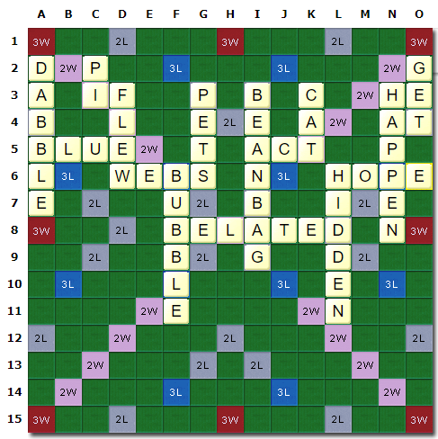

# Scrabble
[Scrabble](https://en.wikipedia.org/wiki/Scrabble) game playable by bots. This repository includes a bot I wrote called BruteForce. Except for BruteForce and BruteForceTest, all code in this repository was written by [Chris Bleakley](https://people.ucd.ie/chris.bleakley).

BruteForce does a brute force search to find the highest scoring legal word placement that can be made on the bot's turn. To do this it first generates all permutations of all subsets of letters in the player's frame, then it generates all possible word placement positions, and then it applies all these permutations at all positions and scores the possible word placements that result.

To play BruteForce against itself run Scrabble.main() with the following program arguments: BruteForce BruteForce

Note: BruteForce runs slowly when there's a blank tile in the player's frame since each blank tile multiplies the number of anagrams by approximately 26.

### Possible Word Placement Positions
I designed an algorithm which generates all possible word placement positions for individual board states. For example, here's an illustration of a particular board state (made on [Scrabulizer](https://www.scrabulizer.com/)) and a list of the word placement positions my algorithm generates for it.

| No. of Letters | Horizontal | Vertical |
| :---: | :---: | :---: |
| **7** | A2, C2, H2, A3, A4, C4, A7, C7, D7, E7, A8, A9, B9, C9, D9, E9, F9, A10, B10, C10, D10, E10, F10, H10, A11, B11, C11, D11, E11, F11, H11, A1, B1, C1, I1, E2, F2, G2, A12, B12, C12, D12, E12, F12, G12, H12, I12 | A1, A2, B1, B2, B3, B4, B5, C1, C2, C5, D1, D2, D3, E1, E2, E3, E4, E5, E6, F1, F2, F3, G1, G2, G3, G8, H1, H2, H3, H4, H5, H6, H7, H8, I1, I2, J1, J2, J3, J4, J5, J7, J8, K1, K2, K3, K7, K8, L1, L2, L3, M1, M2, M3, M4, M5, M6, N1, N2, N3, O1, O2, O6, B7, E8, E9, M8, M9, O8 |
| **6** | A2, C2, I2, A3, C3, A4, C4, D4, A5, A7, C7, D7, E7, F7, A8, B8, A9, B9, C9, D9, E9, F9, H9, A10, B10, C10, D10, E10, F10, H10, I10, A11, B11, C11, D11, E11, F11, H11, I11, A1, B1, C1, J1, E2, F2, G2, H2, A12, B12, C12, D12, E12, F12, G12, H12, I12, J12 | A1, A2, B1, B2, B3, B4, B5, C1, C2, C5, D1, D2, D3, E1, E2, E3, E4, E5, E6, F1, F2, F3, F4, G1, G2, G3, G8, H2, H3, H4, H5, H6, H7, H8, I1, I2, I3, J1, J2, J3, J4, J5, J7, J8, K1, K2, K3, K7, K8, L1, L2, L3, L4, M1, M2, M3, M4, M5, M6, N1, N2, N3, O1, O2, O6, B7, E8, E9, E10, G10, H1, K10, M8, M9, M10, O8 |
| **5** | A2, C2, J2, A3, C3, F3, A4, C4, D4, F4, A5, F5, A6, A7, C7, D7, E7, F7, H7, A8, B8, C8, A9, B9, C9, D9, E9, F9, H9, I9, A10, B10, C10, D10, E10, F10, H10, I10, J10, A11, B11, C11, D11, E11, F11, H11, I11, J11, A1, B1, C1, K1, E2, F2, G2, H2, I2, B12, C12, D12, E12, F12, H12, I12, J12, K12 | A1, A2, B1, B2, B3, B4, B5, C1, C2, C5, D1, D2, D3, E1, E2, E3, E4, E5, E6, F1, F2, F3, F4, F5, G1, G2, G3, G8, H3, H4, H5, H6, H7, H8, I1, I2, I3, J1, J2, J3, J4, J5, J7, J8, K1, K2, K3, K7, K8, L1, L2, L3, L4, L5, M1, M2, M3, M4, M5, M6, N1, N2, N3, O1, O2, O6, B7, E8, E9, E10, E11, G10, G11, H1, H2, K10, K11, M8, M9, M10, M11, O8 |
| **4** | A2, C2, K2, A3, C3, F3, G3, A4, C4, D4, F4, G4, A5, F5, G5, A6, C6, A7, C7, D7, E7, F7, H7, I7, B8, C8, D8, B9, C9, D9, E9, F9, H9, I9, K9, B10, C10, D10, E10, F10, H10, I10, J10, K10, B11, C11, D11, E11, F11, H11, I11, J11, K11, A1, B1, C1, L1, E2, F2, G2, H2, I2, J2, A8, C12, D12, E12, F12, I12, J12, K12, L12 | A1, A2, B1, B2, B3, B4, B5, C1, C2, C5, D1, D2, D3, E2, E3, E4, E5, E6, F2, F3, F4, F5, F6, G1, G2, G3, G8, H4, H5, H6, H7, H8, I1, I2, I3, J1, J2, J3, J4, J5, J7, J8, K1, K2, K3, K7, K8, L2, L3, L4, L5, L6, M2, M3, M4, M5, M6, N1, N2, N3, O1, O2, O6, B7, E1, E8, E9, E10, E11, F1, G10, G11, H1, H2, H3, K10, K11, L1, M1, M8, M9, M10, M11, O8 |
| **3** | A2, C2, L2, A3, C3, F3, G3, I3, A4, C4, D4, F4, G4, I4, A5, F5, G5, I5, A6, C6, D6, A7, C7, D7, E7, F7, H7, I7, K7, C8, D8, E8, C9, D9, E9, F9, H9, I9, K9, L9, C10, D10, E10, F10, I10, J10, K10, L10, C11, D11, E11, F11, I11, J11, K11, L11, A1, B1, C1, M1, E2, F2, G2, H2, I2, J2, K2, A8, H10, D12, E12, F12, J12, K12, L12 | A1, A2, B2, B3, B4, B5, C1, C2, C5, D1, D2, D3, E3, E4, E5, E6, F3, F4, F5, F6, G1, G2, G3, G8, H5, H6, H7, H8, I1, I2, I3, J2, J3, J4, J5, J7, J8, K1, K2, K3, K7, K8, L3, L4, L5, L6, M3, M4, M5, M6, N1, N2, N3, O1, O2, O6, B1, B7, E1, E2, E8, E9, E10, E11, F1, F2, G10, G11, H1, H2, H3, H4, J1, K10, K11, L1, L2, M1, M2, M8, M9, M10, M11, O8 |
| **2** | A2, C2, M2, A3, C3, F3, G3, I3, K3, A4, C4, D4, F4, G4, I4, K4, A5, F5, G5, I5, M5, A6, C6, D6, I6, A7, D7, E7, F7, H7, I7, K7, L7, D8, E8, F8, D9, E9, F9, H9, I9, K9, L9, D10, E10, F10, J10, K10, L10, D11, E11, F11, J11, K11, L11, A1, B1, C1, N1, F2, G2, H2, I2, J2, K2, C7, A8, N9, H10, I10, E12, F12, K12, L12 | A1, A2, B3, B4, B5, C1, C2, C5, D1, D2, D3, E4, E5, E6, F4, F5, F6, G1, G2, G3, G8, H6, H7, H8, I1, I2, I3, J3, J4, J5, J7, J8, K1, K2, K3, K7, K8, L4, L5, L6, M4, M5, M6, N1, N2, N3, O1, O2, O6, B1, B2, B7, E2, E3, E8, E9, E10, E11, F2, F3, G10, G11, H2, H3, H4, H5, J2, K10, K11, L2, L3, M2, M3, M8, M9, M10, M11, O8 |
| **1** | A2, C2, N2, A3, C3, F3, G3, I3, K3, M3, A4, C4, D4, F4, G4, I4, K4, M4, A5, F5, G5, I5, M5, N5, A6, C6, D6, I6, K6, A7, E7, F7, H7, I7, K7, L7, N7, E8, F8, N8, E9, F9, H9, I9, K9, L9, E10, F10, K10, L10, E11, F11, K11, L11 | A1, A2, B4, B5, C1, C2, C5, D2, D3, E5, E6, F5, F6, G2, G3, G8, H7, H8, I2, I3, J4, J5, J7, J8, K2, K3, K7, K8, L5, L6, M5, M6, N2, N3, O1, O2, O6 |

Run BruteForceTest.main() to see a command-line version of this illustration and list of possible word placement positions. You can also easily change the source code to produce an illustration and a list of possible word placement positions for a different board state.
